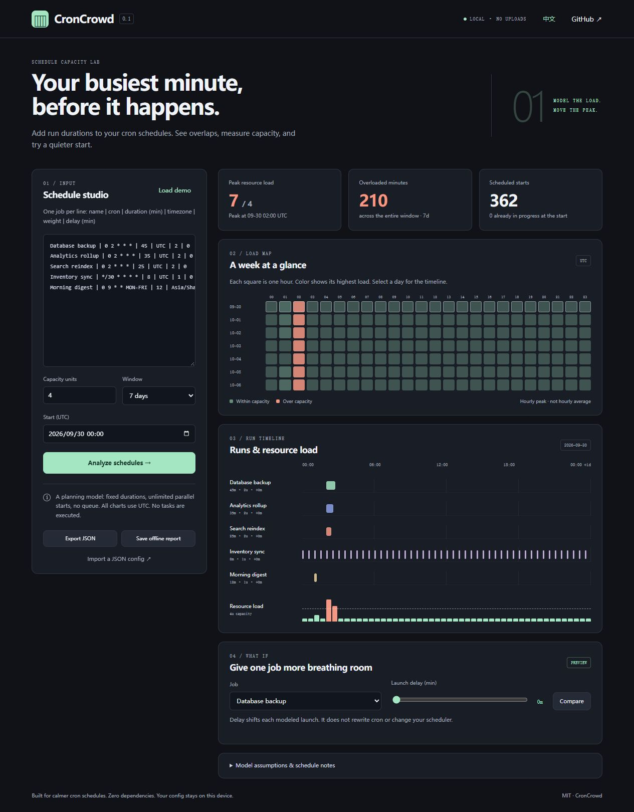

# CronCrowd

**See when your cron jobs overlap — including the work between starts.**

Offline capacity planning for scheduled jobs. Add expected durations and resource weights, inspect a shared timeline, and compare a launch delay before changing your scheduler.

[简体中文](README.zh-CN.md) · [Model & cron semantics](docs/model.md) · [Contributing](CONTRIBUTING.md)



Three jobs at `02:00` can create a predictable spike. Two jobs starting at different minutes can still overlap for most of their run. CronCrowd models both.

## Try it in 30 seconds

Download or clone this repository, then **open [web/index.html](web/index.html) in your browser**. It is a standalone file with no external assets, build step, account, API key, or server required.

Or serve the demo locally with Node.js 20+:

```sh
git clone https://github.com/unbreakableslash/croncrowd.git
cd croncrowd
node bin/croncrowd.mjs demo
# Open http://127.0.0.1:4173
```

Load the demo, select **Search reindex**, set **Launch delay** to **45 minutes**, and click **Compare**. The model shows the change in peak demand and overloaded minutes. **Keep this delay in the model** updates the input; your actual scheduler is never modified.

For the bundled seven-day example starting September 30, 2026, moving **Analytics rollup** by 45 minutes and **Search reindex** by 85 minutes changes peak demand from **7 to 3** units and overloaded minutes from **210 to 0**, at capacity 4. Total work stays the same. The adjusted configuration is included in `examples/staggered.jobs.json`.

## What you get

- **Duration-aware overlap:** catches staggered starts that still contend for resources, including self-overlapping jobs.
- **Weighted capacity:** model workers, database connections, or another consistent unit. A backup can cost 2 units while a sync costs 1.
- **Hourly heatmap and daily timeline:** locate the busiest intervals; the heatmap uses hourly maxima rather than averages that hide spikes.
- **What-if delays:** compare a different launch delay for one job using the same window and capacity.
- **IANA time zones:** use `Asia/Shanghai`, `America/New_York`, or other zones available in your runtime. DST behavior is explicit.
- **Carry-in work:** jobs launched before the window still contribute if they are running inside it.
- **Offline HTML reports:** save an interactive report with your configuration embedded; open it on another device without a server.
- **CLI and CI:** text or JSON results, a reproducible timestamp, and an optional failure code when demand exceeds capacity.
- **English / 简体中文 UI.** Zero runtime dependencies and no telemetry.

## Define your jobs

In the browser, one line per job:

```text
# name | five-field cron | duration minutes | IANA timezone | weight | delay minutes
Database backup | 0 2 * * * | 45 | UTC | 2 | 0
Search reindex | 0 2 * * * | 25 | UTC | 2 | 45
Inventory sync | */30 * * * * | 8 | UTC | 1 | 0
```

Timezone, weight, and delay are optional and default to `UTC`, `1`, and `0`. Names cannot contain `|` or newlines. Import/export JSON for reproducible configuration:

```json
{
  "capacity": 4,
  "jobs": [
    {
      "id": "backup",
      "name": "Database backup",
      "cron": "0 2 * * *",
      "timezone": "UTC",
      "durationMinutes": 45,
      "weight": 2,
      "delayMinutes": 0
    }
  ]
}
```

See [examples/demo.jobs.json](examples/demo.jobs.json) and [examples/staggered.jobs.json](examples/staggered.jobs.json).

## CLI

Run directly from the checkout; no installation is needed:

```sh
node bin/croncrowd.mjs audit examples/demo.jobs.json --from 2026-09-30T00:00:00Z --days 7
node bin/croncrowd.mjs audit examples/demo.jobs.json --from 2026-09-30T00:00:00Z --days 7 --html report.html
node bin/croncrowd.mjs audit examples/demo.jobs.json --from 2026-09-30T00:00:00Z --days 7 --json --fail-on-overload
```

Optionally run `npm install --global .` in the checkout to make `croncrowd` available as a command. This package is not currently published to npm.

| Option | Behavior |
| --- | --- |
| `--from ISO` | Start, including `Z` or an explicit UTC offset; rounds upward to the next minute |
| `--days N` | 1–31 days, default 7 |
| `--capacity N` | Override configuration capacity |
| `--json` | JSON on stdout; status about HTML output goes to stderr |
| `--html FILE` | Write a standalone interactive report with the same config and window |
| `--fail-on-overload` | Exit 1 if any modeled minute exceeds capacity |
| `demo --port N` | Local demo server, bound to `127.0.0.1`; default 4173 |

Exit codes: `0` success; `1` overload when requested; `2` invalid input or I/O error.

## Use in CI

```yaml
- uses: actions/checkout@v4
- uses: actions/setup-node@v4
  with:
    node-version: '22'
- run: node bin/croncrowd.mjs audit examples/staggered.jobs.json --days 7 --fail-on-overload
```

Use a checked-in timestamp with `--from` for a reproducible review, or omit it to audit the next seven days. CronCrowd does not discover or rewrite production job definitions in this release.

## Library

```js
import { simulate, serializableReport } from './src/core.mjs';

const result = simulate(config, { from: '2026-09-30T00:00:00Z', days: 7 });
console.log(result.summary.overloadMinutes);
console.log(JSON.stringify(serializableReport(result)));
```

The pure core is shared by the browser and CLI. `load` and `active` are minute arrays; exported JSON replaces numeric run timestamps with ISO strings and omits those arrays.

## Understand the model

This is a planning simulation using fixed, whole-minute durations. It assumes every launch starts, permits parallel instances, and does not model queues, retries, scheduler latency, locks, variable runtimes, or resource saturation changing duration. Use representative measured durations and a consistent unit for weights.

Supported: five-field cron, lists, non-wrapping ranges, steps, three-letter month/weekday names, Sunday `0`/`7`, and the usual calendar aliases such as `@daily`. Unsupported expressions fail explicitly. Quartz, seconds, years, `H`, `L`, `W`, `?`, and `@reboot` are not supported.

The day fields use Vixie rules. UTC instants are matched to local wall minutes: missing DST minutes do not launch and repeated minutes launch twice. **Your scheduler may use another DST or concurrency policy.** See [docs/model.md](docs/model.md).

Inputs stay in memory unless you export them. Exported HTML and JSON contain job names and schedules; share them only with the intended recipients. No credentials or command strings are needed.

## Development

```sh
node --test
node scripts/build.mjs
node scripts/build.mjs --check
```

Edit `web/template.html`, `web/style.css`, `web/app.js`, and `src/core.mjs`; regenerate the committed `web/index.html`. Tests cover grammar, DST, exclusive interval boundaries, carry-in, self-overlap, fractional weights, CLI exits, and safe HTML embedding. CI runs on Windows, macOS, and Linux with Node.js 20, 22, and 24.

MIT license. Ideas and reproducible bug reports are welcome.
